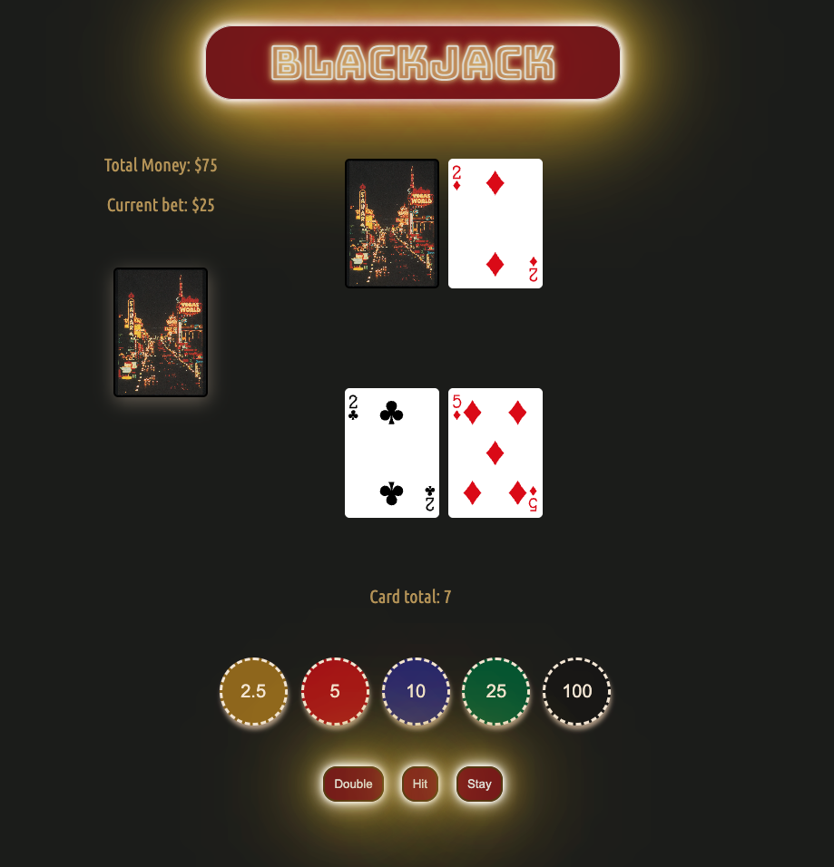

# BlackJack
Click [here](https://andrea-blackjack.netlify.app) to play

## Rules
To play, just click on a chip to place your bet and follow the buttons accordingly!

The card values are as follows: 
* Ace= 1/11
* Face cards= 10
* All other cards equal their respective number

If you don't get 21 or anything near it on your first draw, then you might want to consider hitting. However, if you hit and your card count becomes greater than 21, you bust, meaning the dealer automatically wins and takes your money. If you stay, the dealer must draw until he gets a card count of at least 17. If the dealer busts, then you automatically win and get paid 2x your original bet. If neither of you busts, then whoever has a higher card count will win the round. If you're feeling extra lucky you can double down on your bet (meaning you double your original bet) by clicking the double button. Be careful though, doubling down only allows you to get dealt one other card, however, if you win at the end of the round you get paid out 2x the doubled bet!

## Motivation
I learned to play blackjack while I was a caregiver. The man I took care of loved to go to the casinos to play blackjack, but as he was quadriplegic he always needed someone to take him and play with/for him. He ended up teaching me how to play the game and the basic strategy behind betting and when to hit, stay, double, etc. I fell in love with the game too, so we often spent our time going to nearby casinos or going on casino cruises. As I have been learning to code, I wanted to build my own blackjack game, so that others too could find joy in playing. 

## Attributions 
* Card Deck Library: [Github](https://github.com/ManliestBen/css-card-template.git)- ManliestBen
* Animation Library: [Animate.css](https://animate.style/)
* Bungee and Ubuntu font style: [Google Fonts](https://fonts.google.com/)
* Card Back Image: [Pinterest](https://www.pinterest.com/pin/673217844278686778/)
* Favicon Icon: [Flaticon](https://www.flaticon.com/free-icons/playing-card)

## Technology Implemented
* JavaScript
* CSS
* HTML
* Git
* Animate.css

## Next Steps(icebox items)
* Add an "insurance" feature when the dealer's initial card shows an Ace
* Add a split feature that allows you to split your cards on the initial deal if they are the same card/value
* Add a split feature after the initial split that allows you to split your cards if the next card dealt is also the same card/value
* Add a help feature that will tell you if you should hit, stay, or double based on your cards and the dealer's face-up card